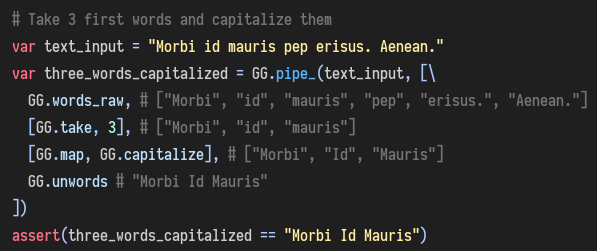

Golden Gadget 🌟
===

⛓️ GDScript utility library focused on functional programming (FP)

Status: ⚗️ **beta** (main functionality is implemented, API changes should be minimal)

✔️️ All functions are covered by [tests](goldenGadget/GGTests.gd).

Examples
---

👉 More info (including installation) at [main library file](goldenGadget/GoldenGadget.gd) and [array wrapper file](goldenGadget/GGArray.gd).

⚙️ Notable features
---
* all functions are handling Arrays and other types as immutable (unless explicitly specified)
* lambdas (anonymous functions, see first screenshot)
* most functions/methods should support following types when expecting a function (referred to as function-like):
  * `FuncRef` - obtained by calling `funcref`
  * `String` - compiled to an anonymous function
  * partially applied functions written as
    * `Array` - a tuple where first item is function-like, second item is value to apply (from right)
    * `with_ctx`/`with_ctx2` - older form, mimics `FuncRef`
* `pipe` function which allows easy chaining of functions, also supports partial application for 2-argument functions (see second screenshot)
* object/dictionary utilities, for example:
   * `key_from_val`: finding a key from value
   * `keys`: unified way of getting array of keys for Dictionary and custom classes
   * `ap_if_defined`: call method when method exists and pass result, otherwise null
* array utilities known from other dynamic and/or functional languages. Golden Gagdet also contains an array wrapper with fluent API (see first screenshot) to streamline working with arrays. some examples:
  * FP classics: `map`, `filter`, `foldl` (aka `reduce`)
  * chopping: `head`, `tail`, `last`, `init`, `take`, `take_right`, `drop`, `drop_right`
  * gluing: `append`, `prepend`, `concat`, `concat_right`
  * `sort`, `zip`, `reverse` (aka `inverse`)
  * `flatten`: flattens one level of array of arrays, e.g. `[[1, 2], [3]]` -> `[1, 2, 3]`
  * `without`: remove all occurrences of given value from an array
  * `sample`/`sample_or_null`: get random item from an array
  * `sum`/`product`
  * `all`/`any`: does predicate (given function returns `true`) for all/any items of an array?
* string helpers like `words`, `unwords`, `lines`, `unlines`, `join`
* function utilities:
  * `call_spread`: invokes a function with given arguments in a form of an array - it "spreads" the arguments (not easily doable in Godot 3.1)
* various utility functions, few examples:
  * `take_screenshot`: take a screenshot and save it. convenient defaults - as path is used `<user_data_of_your_project>/screenshots` and name is current date, e.g. `2019-12-19--13-20-35.png`
  * `delete_children`: delete all children of given `Node`
  * `get_node_or_crash`: safer option to `get_node` which returns current `Node` on empty `NodePath` (thus frequently leading to bugs and strange behaviour)
  * `create_timer_and_start`: creates and starts a `Timer` node, connects your timeout handler (method of object). Also supports repeating mode. Useful when `yield(get_tree().create_timer(1), "timeout")` is leading to `Resumed after yield, but class instance is gone` errors.

Notes
---
All functions should be documented (either in main file or wrapper). If you want to see what those functions are doing, you can peek at the test file (brief explanation of *test cases* is at the end of the test file).

While I tried optimized most functions, using this library will probably lead to worse performance compared to native solutions (e.g. using `for`s, mutable variables). But looking at the future - when JIT arrives, differences in performance might not be significant. Generally, I would not recommend building too many wrappers in `_process` and `_physics_process` especially if you are targeting mobile platforms.

🗒 License
---
MIT
